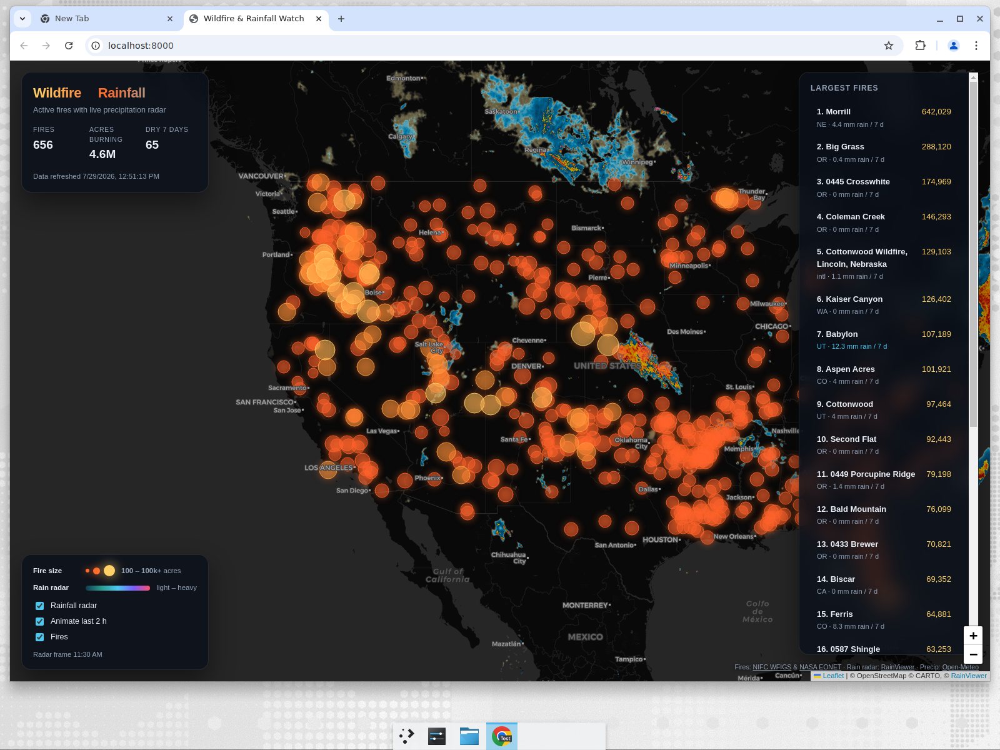

# Wildfire &amp; Rainfall Watch

A static GitHub Pages site showing active wildfires, how fast they are growing,
where the smoke is going, and who is breathing it — with a live rainfall radar
overlay and per-fire precipitation history.



## Data

| Layer | Source | Refreshed |
| --- | --- | --- |
| US incidents (>=10 acres) | [NIFC WFIGS](https://data-nifc.opendata.arcgis.com/) | at build time |
| Precipitation, past 7 d + 3 d forecast | [Open-Meteo](https://open-meteo.com/) | at build time |
| Rainfall radar tiles (last 2 h, animated) | [RainViewer](https://www.rainviewer.com/) | live in the browser |
| Air quality (US AQI, PM2.5) near large fires | [Open-Meteo](https://open-meteo.com/) | at build time |
| Smoke plumes (light / medium / heavy) | [NOAA HMS](https://www.ospo.noaa.gov/products/land/hms.html) | at build time, daily product |
| US cities used for smoke exposure | [GeoNames](https://www.geonames.org/) (CC BY 4.0) | static, `scripts/build_cities.py` |

No API keys are required.

### Growth history

`data/history.json` records `(timestamp, acres, containment)` per fire on every
run, keyed by the WFIGS `IrwinID`. Growth is reported only by comparing against
a snapshot that was genuinely recorded 18–36 h earlier — it is never inferred or
interpolated, and fires without a qualifying baseline simply show no 24 h figure.
The deploy workflow commits this file back to `main` so the series accumulates
across runs.

Until a fire has two qualifying snapshots, the UI falls back to the average
acres/day since discovery, labelled as a lifetime average rather than as recent
growth.

### Smoke exposure

The "people under smoke" figure counts the population of US cities of 15k+ whose
*centre point* falls inside a NOAA HMS plume. It is a deliberate floor, not a
total: it ignores rural population and everyone in a city whose centre sits just
outside a plume edge. The UI says so.

## Tests

```bash
python3 -m unittest discover -s scripts -p 'test_*.py'
```

These cover the two places the site computes rather than relays — growth deltas
and smoke exposure.

## Reliability

Every enrichment source except WFIGS is optional: if it fails the build records the failure
in `data/summary.json` under `sources` and the page renders without that layer.
Additional guards:

- ArcGIS signals rate limits as HTTP 200 with an error body, so error payloads
  are detected explicitly and retried with a per-minute-quota backoff.
- The incident count is verified against the service's own `returnCountOnly`
  total, so a silently truncated page is treated as a failure.
- An empty fire list never overwrites good data; the previous snapshot is kept.
- If WFIGS is unavailable the deploy still succeeds with the previous data,
  because a slightly stale map beats no map.

## Rebuild

```bash
./scripts/rebuild.sh            # refresh fires, smoke, summary + growth history
COMMIT_DATA=1 ./scripts/rebuild.sh   # also commit the refreshed snapshot
python3 -m http.server 8000     # preview at http://localhost:8000
```

## Git hook

Enable the bundled hooks once per clone:

```bash
git config core.hooksPath .githooks
```

- `pre-push` refreshes and commits the data snapshot before each push.
- `post-merge` refreshes the local snapshot after each pull.

Set `SKIP_DATA_REFRESH=1` to bypass either hook.

## Deployment

`.github/workflows/deploy.yml` refreshes the data and publishes to GitHub Pages
on every push to `main`, every 3 hours on a schedule, and on manual dispatch.
Enable it under **Settings → Pages → Source: GitHub Actions**.
